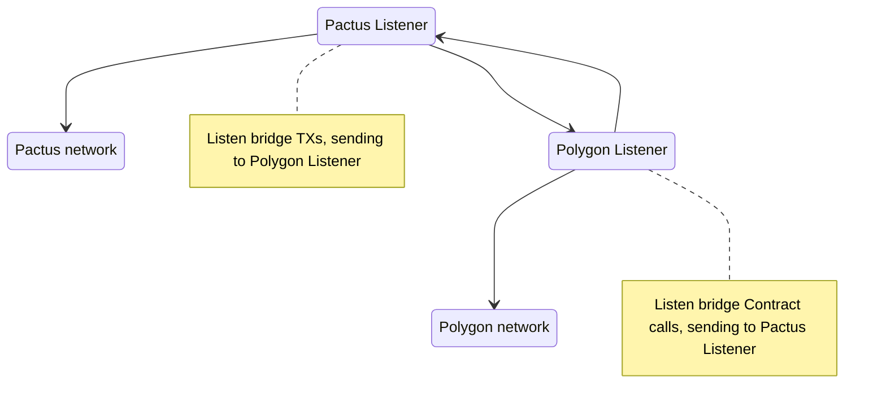

# Wrapto Protocol V1

In this document we will talk about how Wrapto protocol V1 works.

## Semi-centralized model

The Wrapto V1 is a semi-centralized protocol because the lack of smart contract support in Pactus blockchain. Minting new wPAC on other networks are centralized same as unlocking locked PACs. It's planned to make it fully decentralized after Pactus updates.

## Workflow

Here is a simple workflow of how Wrapto works:

[!IMPORTANT]
> The term listener is same as actor in this [document](./design.md).



[!NOTE]
> This mermaid diagram need improvements.

Based on the chart we saw, a module listens to each transaction with this structure on Pactus network:

The memo:
```
DESTINATION_NETWORK_ADDRESS@DESTINATION_NETWORK_ID
```

Example:

```
0xa6a9Def75CA1339Cb3514778948A1D67D826D89A@POLYGON
```

Amount:

more than 1 PAC

Destination:

The Wrapto lock address on Pactus network. it's available at [Wrapto website](https://wrapto.app).

Later Pactus listener fins the destination based on memo and send a message to specified listener ([actors](./design.md)). Invalid memos will be counted as donations.

Other networks will listen token smart contract and check burn/bridge functions, if there was any, they will send a message to Pactus listener to unlock PAC on Pactus network. The Pactus unlock address must br provided in contract call otherwise its burning tokens and locked PACs on Pactus will be counted as fees.

### Rate and Health

The rate of PAC and wPAC is always 1:1 constantly. To check whether the bridge is healthy or not, you can check the `l >= (m + f)`, where the `l` is balance of Wrapto lock address in Pactus network and `m` is total wPAC minted in all of networks anf f is the fee needed to bridge all tokens on other networks to Pactus in worst case. If it was true, bridge is healthy.

> To calculate f: divided total of wPAC by 2. `t = m / 2` and calculate the fee of t transactions with 1 PAC amount on Pactus network.
That means if you make most bridges you can with 2 PACs the lock address has enough fee to pay for it and unlock tokens. which has a very low possibility yo happen. more stuff like fee for minting wPAC is needed in Wrapto service, but here we considered only Pactus. Decentralized version of Wrapto will make this health check much easier.  

Fees are exclusive for example consider fee 1 PAC (find the fee detail [here](./design.md)), if you bridge 10 PAC to polygon you will receive 9 wPAC then. 10 PAC is PAC is balance of lock address and can be collected by team without hurting the health of bridge.

So, sending invalid TX in lock address or burning wPAC means making more balance on lock address with no token on the other networks and they are fees and donations.

## Structures

Here we explain data structures used in Wrapto.

## Order

Each request to unlock PAC or mint wPAC will be wrapped in a structure called Order (bridge order), listeners can execute this orders.

Here is Order example in Golang:

```go
type Order struct {
	// * unique ID on Wrapto system.
	ID string

	// * transaction or contract call that user made on source network.
	TxHash string

	// * address of receiver account on destination network.
	Receiver string

	// * address of sender on source network (account that made bridge transaction).
	Sender string

	// * amount of PAC to be bridged, **including fee**.
	amount amount.Amount

	// * status of order on Wrapto system.
	Status Status

	// * type of bridge.
	BridgeType BridgeType
}
```

You can find full detail [here](../../types/order).

## Message

Each Order needs to be transfer between listeners, we send Order and other data between actors in Message structure, here is Golang example:

```go
type Message struct {
	To      bypass.Name
	From    bypass.Name
	Payload *order.Order
}
```

You can find full detail [here](../../types/message).
